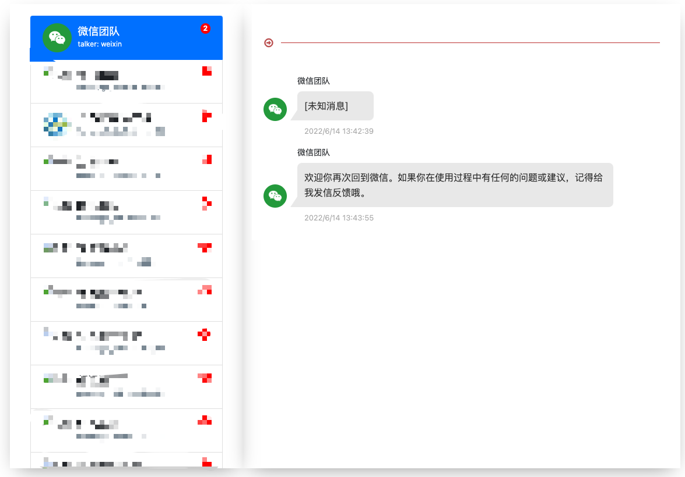

> ### *此项目停止维护，如需二次开发，请自行 fork*

## 效果图


## 使用流程
> 详细说明在: https://blog.greycode.top/posts/android-wechat-bak/

1. 手机聊天记录备份到电脑，在有 ROOT 权限的手机上登陆微信，电脑点击备份恢复，把聊天记录恢复到有 ROOT 的手机上。
2. 收集下面这些数据，然后放在**同一个文件夹下**:
    - image2 文件夹：里面存放着所有的微信聊天图片，位置在：/data/data/com.tencent.mm/MicroMsg/[32位字母]/image2
    - voice2 文件夹：里面存放着所有的微信语音，位置在：/sdcard/Android/data/com.tencent.mm/MicroMsg/[32位字母]/voice2
    - video 文件夹：里面存放着所有的微信视频，位置在：/sdcard/Android/data/com.tencent.mm/MicroMsg/[32位字母]/video
    - avatar 文件夹：里面存放着所有的微信头像，位置在：/data/data/com.tencent.mm/MicroMsg/[32位字母]/avatar
    - Download 文件夹: 微信的聊天发送的文件存放在这里，位置在：/sdcard/Android/data/com.tencent.mm/MicroMsg/Download
    - EnMicroMsg.db: 微信的数据库文件，位置在：/data/data/com.tencent.mm/MicroMsg/[32位字母]/EnMicroMsg.db
    - WxFileIndex.db: 微信的文件索引数据库文件，位置在：/data/data/com.tencent.mm/MicroMsg/[32位字母]/WxFileIndex.db
3. 获取解密 DB 的密钥。
4. 进行微信聊天数据 DB 的解密
5. 转换微信语音
6. 运行本程序，打开控制台输出的网址，就可以查看你的聊天记录了。

### 运行命令

可以直接运行：

```shell
$ git clone https://github.com/greycodee/wechat-backup.git
$ cd wechat-backup
$ go run main.go -f '[替换成你的微信备份文件路径]'
```

或者编译后运行：
```shell
$ git clone https://github.com/greycodee/wechat-backup.git
$ cd wechat-backup
$ go build .
$ ./wechat-backup -f '[替换成你的微信备份文件路径]'
```

> ~~注意⚠️：WxFileIndex.db 里面文数据表名老版本微信是 WxFileIndex2 ,新版本微信是 WxFileIndex3 ，请根据实际情况来设置代码 wxfileindex.go 文件中 SQL 查询的表名~~(已在代码中做处理)

## 快速解密微信DB
把要解密的微信 DB 所在文件夹挂在到容器的 `/wcdb` 上面。
```shell
$ docker run --rm -v /Users/zheng/Documents:/wcdb  greycodee/wcdb-sqlcipher -f DB名字 -k 解密密钥

2022/06/22 05:31:17 开始解密...
2022/06/22 05:31:28 解密成功: ok
2022/06/22 05:31:28 明文数据库文件名: EnMicroMsg_plain.db
```

## 快速转换微信语音 amr 文件
把要转换的语音文件夹挂载到容器的 `/media` 目录上，然后执行下面的命令，就会自动将文件夹里的语音转换成 `mp3` 格式了。
```shell
$ docker run --rm -v /Users/zheng/Documents/voice2:/media  greycodee/silkv3-decoder

/media/msg_491351061422dbfa9bb0a84104.amr
-e [OK] Convert /media/msg_491351061422dbfa9bb0a84104.amr To /media/msg_491351061422dbfa9bb0a84104.mp3 Finish.
```

## 手机没有 ROOT 解决方法
如果没有有 ROOT 的手机，根据 V 友的说法，使用安卓模拟器的话有一定的封号机率。这个还有一个方法就是使用手机自带的系统备份。
我自己是miui系统的手机，整理了大致方法如下：

1. 在手机设置里找到备份功能，然后备份微信应用数据
2. 备份的数据放在手机的 MIUI/backup/AllBackup/备份的日期/ 下
3. 里面有三个文件 分别是 .bak .zip .xml 结尾
4. zip 可以直接解压，然后获取聊天语音和聊天视频等文件
5. bak 需要使用 HEX 编辑器打开，然后将 41 4E 前的数据删除（就是这个文件的描述数据）。然后保存
6. 使用 abe 解包工具进行 .bak 文件的解包，开源工具地址：https://github.com/nelenkov/android-backup-extractor
7. 解压解包后生产的 tar 压缩包，然后从里面可以获取到 DB 等文件（相当于本来要ROOT后才能获取到的这些数据，现在可以直接获取了）

> 我这边通过系统备份然后 bak 文件解包-解压后，文件路径在：apps/com.tencent.mm/r/MicroMsg/ 下，大家可以参考一下
> 如果通过手机系统自带的备份来获取数据时，解密 DB 的密码可以通过这篇文章的方法一来获取： [获取 DB 解密密码](https://blog.greycode.top/posts/android-wechat-bak/#%E8%8E%B7%E5%8F%96-db-%E8%AE%BF%E9%97%AE%E5%AF%86%E7%A0%81)

## Q&A
### 语音和视频所在文件夹
在 `/data/data/com.tencent.mm/MicroMsg/[32位字母]` 文件夹下，有个 `account.mapping` 文件，里面对应的 `/sdcard/Android/data/com.tencent.mm/MicroMsg` 下文件夹的名称，里面存储了聊天视频和语音等文件。

### 一台设备登陆多个微信怎么查找 uin？
在 `/data/data/com.tencent.mm/shared_prefs` 文件夹下有个 `app_brand_global_sp.xml` 文件，里面存放着所有登陆过微信的 uin，然后可以用这些 uin 去解密对应的微信 DB。

## Star History

[](https://star-history.com/?utm_source=bestxtools.com#greycodee/wechat-backup&Date)

