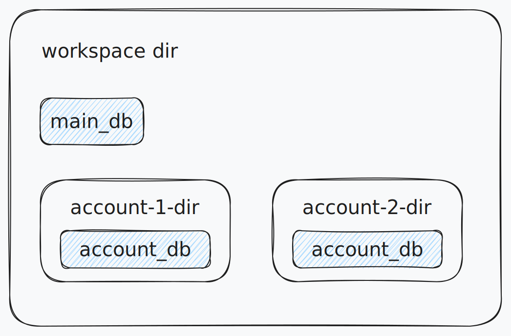

# WeChatSaver


## Dependencies
- FFmpeg
- sqlcipher
 - 编译的时候，要加上环境变量`RUSTFLAGS="-L /opt/homebrew/opt/sqlcipher/lib"`
```shell
# 依赖
rusqlite = {version = "0.32.1",features = ["sqlcipher"]}
# 编译的时候，要加上环境变量
 export RUSTFLAGS="-L /opt/homebrew/opt/sqlcipher/lib"
```

## Process Flow





## module

- **wechat-saver-lib**: 只进行本地io相关操作，不涉及网络相关操作
- **wechat-api**: 提供http api接口，提供文件上传的接口。处理逻辑使用`wechat-saver-lib`模块
- **wechat-web**: web页面
  
## TODO

- [ ] optimize unit test
- [ ] send progress data of file extract 

依赖:
```bash
sudo apt install clang
```

## 安装 sqlcipher

1. 下载 SQLCipher 的源码：
```bash
git clone https://github.com/sqlcipher/sqlcipher.git
cd sqlcipher
```
2. 安装必要依赖
```bash
sudo apt update
sudo apt install -y build-essential autoconf automake libtool pkg-config
sudo apt install -y libssl-dev
sudo apt install -y tcl
```
3. 配置并编译 SQLCipher：
```bash
./configure --enable-tempstore=yes CFLAGS="-DSQLITE_HAS_CODEC" LDFLAGS="-lcrypto"
make
sudo make install
```

4. 检查是否安装成功：

```bash
sqlcipher
```

5. 配置动态链接库

将 /usr/local/lib 添加到全局的环境变量中： 

编辑你的 shell 配置文件（如 ~/.bashrc 或 ~/.zshrc）：

添加以下内容：

```bash
export LD_LIBRARY_PATH=/usr/local/lib:$LD_LIBRARY_PATH
```
